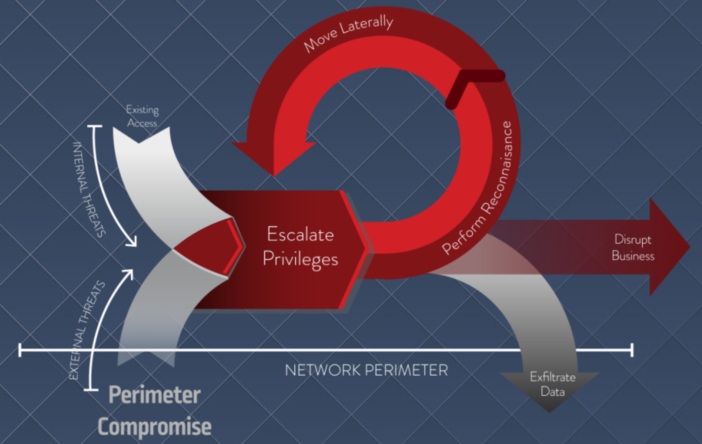

- [1. Introduction to CyberArk Privileged Access Security](#1-introduction-to-cyberark-privileged-access-security)
- [2. Introduction to User Accounts and Privileged Account Security](#2-introduction-to-user-accounts-and-privileged-account-security)
  - [2.1. user accounts](#21-user-accounts)
  - [2.2. privileged account security:](#22-privileged-account-security)
  - [2.3. what can a privileged account be used for?](#23-what-can-a-privileged-account-be-used-for)
  - [2.4. privileged account in the organization:](#24-privileged-account-in-the-organization)
- [3. Business Risk – Insider Threat](#3-business-risk--insider-threat)
  - [3.1. objectives](#31-objectives)
  - [3.2. who is the insider threat?](#32-who-is-the-insider-threat)
    - [3.2.1. exploited insider:](#321-exploited-insider)
    - [3.2.2. malicious insider:](#322-malicious-insider)
    - [3.2.3. unintentional insiders:](#323-unintentional-insiders)
    - [3.2.4. external insider:](#324-external-insider)
  - [3.3. why do insiders turn rogue?](#33-why-do-insiders-turn-rogue)
  - [3.4. how malicious insiders cause damage:](#34-how-malicious-insiders-cause-damage)
  - [3.5. reducing risk & quickly detecting insider threats](#35-reducing-risk--quickly-detecting-insider-threats)
- [4. Business Risk – Targeted Attacks and the attack life-cycle"](#4-business-risk--targeted-attacks-and-the-attack-life-cycle)
  - [4.1. agenda](#41-agenda)
  - [4.2. what are targeted attacks](#42-what-are-targeted-attacks)
    - [4.2.1. actors & tactics](#421-actors--tactics)
    - [4.2.2. the cyber attack lifecycle](#422-the-cyber-attack-lifecycle)
      - [4.2.2.1. external recon](#4221-external-recon)
      - [4.2.2.2. breach](#4222-breach)
      - [4.2.2.3. internal recon](#4223-internal-recon)
      - [4.2.2.4. lateral movement](#4224-lateral-movement)
      - [4.2.2.5. domain compromised](#4225-domain-compromised)
      - [4.2.2.6. exfiltration / end game](#4226-exfiltration--end-game)
      - [4.2.2.7. privilege is at the center of the attack](#4227-privilege-is-at-the-center-of-the-attack)
  - [4.3. recommendations](#43-recommendations)
    - [4.3.1. implement endpoint protection](#431-implement-endpoint-protection)
    - [4.3.2. monitor and detect privileged threat](#432-monitor-and-detect-privileged-threat)
    - [4.3.3. secure and control credentials](#433-secure-and-control-credentials)
- [5. Business Risk – Ransomware The CyberArk Solutions](#5-business-risk--ransomware-the-cyberark-solutions)
  - [5.1. agenda](#51-agenda)
  - [5.2. what is ransomware](#52-what-is-ransomware)
  - [5.3. ransomware can impact orgs of all types](#53-ransomware-can-impact-orgs-of-all-types)
  - [5.4. ransomware in action](#54-ransomware-in-action)
    - [5.4.1. how does a machine get infected](#541-how-does-a-machine-get-infected)
    - [5.4.2. retrieve an encryption key](#542-retrieve-an-encryption-key)
    - [5.4.3. build a file inventory](#543-build-a-file-inventory)
    - [5.4.4. attmpts to propagate](#544-attmpts-to-propagate)
    - [5.4.5. spread through network](#545-spread-through-network)
    - [5.4.6. encrypt, notify, repeat](#546-encrypt-notify-repeat)
  - [5.5. what makes ransomware so successful](#55-what-makes-ransomware-so-successful)
  - [5.6. where can you break the attack chain?](#56-where-can-you-break-the-attack-chain)
  - [5.7. file protection using application control](#57-file-protection-using-application-control)
  - [5.8. recommendations](#58-recommendations)
- [6. CyberArk Blueprint for PAM Success](#6-cyberark-blueprint-for-pam-success)
  - [6.1. agenda](#61-agenda)
  - [6.2. designing a PAM program](#62-designing-a-pam-program)
  - [6.3. why the blueprint](#63-why-the-blueprint)
  - [6.4. guiding principles:](#64-guiding-principles)
    - [6.4.1. Prevent Credential theft:](#641-prevent-credential-theft)
    - [6.4.2. lateral and vertical movement](#642-lateral-and-vertical-movement)
    - [6.4.3. limit privilege esc & abuse](#643-limit-privilege-esc--abuse)
    - [6.4.4. goals](#644-goals)
  - [6.5. principle 1: prevent cred theft](#65-principle-1-prevent-cred-theft)
    - [6.5.1. three prevention mechanisms](#651-three-prevention-mechanisms)
      - [6.5.1.1. session isolation](#6511-session-isolation)
  - [6.6. priniple 2: stop lateral and vertical movement](#66-priniple-2-stop-lateral-and-vertical-movement)
- [7. Introduction to DevOps and Secrets Management](#7-introduction-to-devops-and-secrets-management)
- [8. CyberArk and the CyberArk Solution](#8-cyberark-and-the-cyberark-solution)

# 1. Introduction to CyberArk Privileged Access Security

https://training.cyberark.com/user/consume/course_pathway/91cae047-31e0-301c-a982-bf80725f7094/652/65454f6d-886f-3562-add4-b4dad777bc4f?complete=0&tab=overview

Great, more ServiceRocket training.

# 2. Introduction to User Accounts and Privileged Account Security

## 2.1. user accounts

* standard user account
    * combines username and privileges
    * credential types:
        * username and password combination
        * ssh key (used in sso, and automated processes)
* super user:
    * special user account used for administration
    * capable of making unrestricted, potentially adverse, system-wide changes.
    * example usernames:
        * root, administrator, admin, supervisor, sa (MSSQL), sys (oracle), enable (cisco) <-- wat.
    * username may not be the sole identifier of the user account type.
        * *nix: root account has a user identifier of 0
        * RBAC: (Windows, etc)
            * anyone who has capabilities of a super user, is a super user.
* application account:
    * special user accounts for a computer application or group of applications
    * applications need to automatically connect to various systems, DBs, networks and other applications.
* service account:
    * a special user account htat an application or service uses to interact with the OS.
    * services use the service account to log on and make changes to the OS or config.

## 2.2. privileged account security:
* what is a privileged account?
    * any account that can access important or sensitive data, PHI, CC#, SSN, IP.
    * types:
        * elevated personal user accounts
            * define
                * operational access
                * unrestricted access
            * type of accounts:
                * it personnel accounts
                * executive accounts
                * SaaS administrators
                * Local admin account
            * used by:
                * IT satff
                * executives
                * any employee
            * used for:
                * privileged operations
                * access to sensitive data
                * managing web-based apps
        * shared privileged accounts
            * define:
                * Windows administrator, *nix root, corporate media accounts, registrar, ARIN, etc.
                    * business critical applications
                    * sensitive data
                    * social media
            * type of accounts:
                * admin/root/cisco enable/oracle sys/mssql sa/local admin
            * used by:
                * applications/scripts
                * windows services
                * scheduled tasks
                * batch jobs, scripts, other
                * developers
            * used for:
                * privleged operations
                * disaster recovery
                * emergency
                * administration
                * access to sensitive data
        * Application accounts:
            * define:
                * application accounts, service accounts
                    * communicate and share data
            * type of accounts
                * service accounts
                * hard coded / embedded app IDs
            * used by:
                * applications/scripts
                * windows services
                * scheduled tasks
                * batch jobs, scripts, other
                * developers
            * used for:
                * Online DB access
                * batch processing
                * inter-application communication

## 2.3. what can a privileged account be used for?
    * access sensitive data
        * good: accountant ERP system for salary, people who access intellectual property
        * evil: data can leak causing financial and reputational data
    * change system configurations
        * good: starting or stopping services, or connecting endpoints to authorized mapped drives.
        * evil: connect to c2 servers, capture user activity
    * install software / apply updates
        * good: install a/v, or applications
        * evil: malware install
    * access and change accounts
        * good: change passwords, enforce organizational privilege policies
        * evil: lock true users out of machines

## 2.4. privileged account in the organization:
    * privileged accounts exist everywhere
        * not only IT accounts
        * broaden your horizon: social media, employees all have accounts
        * count of privileged accounts are three times that of employees
        * personally, everyone has privileged accounts: social media, login to bank.
    * access a network segment, or changes firewall rules, access to DC, or dump DB data
        * unprotected, unmonitored, privileged accounts are the way to go
    * mandiant:
        * go after privileged accounts
        * 100% of breaches involved stolen creds

    
# 3. Business Risk – Insider Threat

## 3.1. objectives
* what is an insider threat?
* are they always malicious?
* what are they after?
* why do insiders turn rogue?
* how do insiders cause damage?

## 3.2. who is the insider threat?

* surveys show that most insider threats occur by inadvertant employee behavior
* there are four malicious insiders as follows

### 3.2.1. exploited insider:
* example:
  * 225000 residents in western ukraine
    * attackers exploited legitimate users
* common targets are high value employees with spearphishing campaigns
  * it admins, execs, helpdesk
  * can pivot throughout organization and establish a foothold

### 3.2.2. malicious insider:
* example:
  * sage employee used an internal login to gain unauthed access to information
* just 26% of incidents
  * most difficult to detect
  * most costly
  * knowledge of and access to sensitive info
  * can often legitimately bypass security controls

### 3.2.3. unintentional insiders:
* phishing request for w2 forms
* no malicious intent but they can unintentionally put data and systems at risk
* 

### 3.2.4. external insider:
* example:
  * Healthcare company example:
  * a third party that has high levels of access to the system
* at least 60% of orgs allow remote access to internal networks from third party vendors
  * these users can turn into bad actors: exploited insiders, unintentional insiders, malicious insiders...
    * But they aren't managed by your organization

## 3.3. why do insiders turn rogue?
* you can identify high risk users prior to an attack
  * Outside influence: their actions are coerced by a crime ring or nation-state.
  * Anger: they feel as if their employer or manager has done somethign wrong.
  * Hacktivism: they are motificated by political or religious beliefs.
  * Financial: they have a large debt.

## 3.4. how malicious insiders cause damage:
* they do not need to compromise the perimeter
* they utilize their existing access to escalate privleges, perform recon, move laterally, then either disrupt business or exfiltrate data.

## 3.5. reducing risk & quickly detecting insider threats
* utilize these five recommendations:
  * practice least privilege:
    * reduce the attack surfaec to limit insider threat by restricting standard user privileges based on role.
  * secure privileged accounts
    * store privileged account credentials in a secure, central repo that supports strong access control, multi-factor auth and full availability.  Rotate creds on a regular basis.
  * apply segregation of duties
    * segregate admin duties based on privileged user specific roles.
  * educate users:
    * train users to be aware of phishing threats and how to identify fraudulent emails.
  * monitor & audit usage
    * monitor an analyze privileged user and account behavior to learn what's normal so you can more easily identify abnormalities that may indicate an attack or breach is in process.

# 4. Business Risk – Targeted Attacks and the attack life-cycle"

## 4.1. agenda
* overview of targeted attacks
* actors & tactics
* cyber attack lifecycle

## 4.2. what are targeted attacks

* attack can be considered targeted:
  * attackers focus on a group of orgs, an org, or specific employees
  * objective is infiltrate target network, to exfiltrate data or disrupt business
  * maintain persistence
  * considerable effort to make sure that their goals are acheived

### 4.2.1. actors & tactics

* key findings from 2017 VZ data breach investigation
  * 75% of breaches were carried out by outsiders that infilitrated perimeter
  * 81$ of breaches leveraged either stolen and/or weak passwords

### 4.2.2. the cyber attack lifecycle

* Internal team at cyberark studies attacks and have derived a general attack pattern

#### 4.2.2.1. external recon
* collect enough intelligence to successfully attack target org
* attack surface: total sum of vulns in a network that are accessible to the internet
  * unpatched systems
  * ip address ranges
  * open ports
  * target endpoints

#### 4.2.2.2. breach
* methods:
  * spear-phishing attack
    * electronic communication scam to target specific people
      * may install malware
      * may end up in data exfilitration
  * zero-day exploits
    * any flaw that is unknown to the vendor
  * customized malware
    * malware customized to get around various security technologies
  * drive-by-download
    * infects a computer by having a user visit a web site that is running malicious code. 
  * social engineering
    * manipulating people to give up confidential info or access to the network.

#### 4.2.2.3. internal recon
* using privileges that attacker obtained
* purpose: id accounst that can get them closer to their goal
  * checks which assets he can access
  * checks who the privileged users are
  * checks what privileges they have
  * goal is to move laterally

#### 4.2.2.4. lateral movement
* goal: take control other OS instances, includign DCs
* move around the network
  * mapping internal systems
    * discovery actions
  * harvesting creds

#### 4.2.2.5. domain compromised
* one priv esc occurs, continue to gather information and/or implant software, etc.

#### 4.2.2.6. exfiltration / end game
* it's possible that if the attacker is seeking PII/PHI/IP, etc, exfil of data is possible

#### 4.2.2.7. privilege is at the center of the attack

* attackers are resident over average for 146 days
* remember path of life cycle
  * external --> internal
  * enum/recon
  * priv esc
  * enum/recon
  * priv esc --> Golden ticket attack for instance
  * result: disrupt business/data exfil

## 4.3. recommendations

### 4.3.1. implement endpoint protection
* remove local admin rights from standard users
* control applications to minimize malware infection risks
* patch systems to remediate known vulns
* encourage usres to be suspicious of phishing

### 4.3.2. monitor and detect privileged threat
* examine privileged session activity to detect insider threats
* analyze user and account behavior to detect anomalous activity
* 

### 4.3.3. secure and control credentials
* use MFA
* change admin passwords frequently
* require unique local admin passwords on each system
* protectively secure and monitor the use of high-value accounts
* segement the network to limit access to sensitive IT systems
* isolate and restrict access to critical systems

# 5. Business Risk – Ransomware The CyberArk Solutions

* ransomware makes up 40% of attacks.
* 1989 is first recorded ransomware attack

## 5.1. agenda
* ransomware attack landscope
* how ransomeware works
* what makes randomware successful
* app control
* recommendations

## 5.2. what is ransomware
* a type of malware: that focuses on revealing data publicly, or encrypting data to make it unavailable.

## 5.3. ransomware can impact orgs of all types
* attack impact
* $325 million was paid in 2015
* estimation that cyber incidents will result in $6 trillion by 2021.

## 5.4. ransomware in action

### 5.4.1. how does a machine get infected
* malicious email
  * sender email address
  * link dst
* advertising service compromise
* once infected, the ransomware may spread
  * it may wait for a specific application to run
  * it may wait for a time

### 5.4.2. retrieve an encryption key
* connection may be made to external resource to obtain encryption key
  * 20% of ransomware would stop immediately if this connection was blocked
  * 70% of ransomeware would use a default key that was embedded in the ransomware itself

### 5.4.3. build a file inventory
* scans for files local on the machine or on shared drives

### 5.4.4. attmpts to propagate
* scans for connected machines
* scans for user creds

### 5.4.5. spread through network
* often uses captured creds to install itself on more machines

### 5.4.6. encrypt, notify, repeat
* it will utilize the file inventory to encrypt files

## 5.5. what makes ransomware so successful
* polymorphic malware helps attacker evade detection
  * evading traditional AV.
* ransomware doesn't need admin creds
  * it mimics a user.

## 5.6. where can you break the attack chain?
* protect the perimeter
  * difficult to catch as the files are polymorphic
* block the conversation to the key server 
  * damage still possible
* protection at file level
  * which proved to be most effective in lab tests

## 5.7. file protection using application control
* protecting at file level
  * application control
    * whitelist
      * known, trusted, and good
      * for servers that run the same application over time
      * impractical for endpoints (this is argubly WRONG!)
    * blacklist
      * known, not trusted, and malicious
      * often not complete
    * greylist (99.97% effective)
      * specify policies for unknown applications
        * ex: invoke restricted mode
          * no internet access, etc
          * no access to network shares
          * restrict file rights

## 5.8. recommendations
* whitelist apps on servers
* restrict permissions for greylisted applications
* remove local admin rights from standard users
  * blocks most malware from running
  * 10% of ransomware to fail immediately
* follow general best practices for AV
* data backups

# 6. CyberArk Blueprint for PAM Success

## 6.1. agenda
* review current challenges desigining a PAM program
* learn what cyberark blueprint is and how it was developed.
* Understand hwow the blueprint phased approach helps design a successful PAM program roadmap.
* Learn where to get more info on cyberark blueprint

## 6.2. designing a PAM program

* Cyberark's cyber hygiene program (circa 2018):
  * secure SaaS admins and privileged bueiness user
  * defend DevOps in the cloud and on-prem
  * Secure SSH keys on critical *nix servers
  * Protect 3rd party privileged application accounts
  * limit attacker movement from endpoints
  * Control and secure infrastructure accounts
  * Protect against irreversible network takeover attacks
* Cyberark blueprint for PAM success is a superset of the cyuberark cyber hygiene program
  * It is a guide focused on mitigating risk across three attack stages
    * prevent credential theft
    * stop laternal & veritcal movement
    * limit privilege escalation & abuse

## 6.3. why the blueprint
* phased risk based approach, risk migitation milestores.
* built with future proofing in mind
* general security best practices, and recommendations under going digital transformation projects, like migration to cloud, adapting DevOps, or leveraging SaaS...
* PAM enterprise best practices from Cyberark:
  * 5000+, >50% of fortune 500
  * incident response and red team

## 6.4. guiding principles:

### 6.4.1. Prevent Credential theft:
* prevent theft of critical credentials such as IaaS admins, domain admins or API keys via:
  * session isolation
  * hard coded credential removal
  * Theft detectiona and blocking
  * Questions:
    * credential residue prevention

### 6.4.2. lateral and vertical movement
* Stop the pivoting from non-trusted devices to high-value cloud consoles or domain controllers through enforcement of credential boundaries, non-persistent access, and credential randomization.
  * Questions:
    * stop adversary from pivitong from non-trusted domains to a high risk domains
    * stop from on-prem to cloud

### 6.4.3. limit privilege esc & abuse
* limit the ability to gain and/or misuse admin privileges through strong least priv, behavioral analytics, and adaptive response.
  * questions:
    * reduce the number of capabilities and number of privileged accounts (which reduces attack surface)
    * reduce the number of ways users gain privileges to limit the opportunities for escalation
    * establish a baseline for what privileged accounts should actually be used for

### 6.4.4. goals
* the blueprint focuses on one thing:
  * if the use case that's being worked doesn't push the following, then it isn't that important:
    * preventing credential theft
    * stopping lateral & vertical movement
    * limiting privileged escalation and abube
  
## 6.5. principle 1: prevent cred theft
* attackers initially look for creds.
  * social engineer / keystroke logging
  * memory searching
  * targeted repos
* third parties are also a threat vector

### 6.5.1. three prevention mechanisms

#### 6.5.1.1. session isolation
* leverage session isolation: allow users full control of the privileged account as they would normally expect, but without ever showing or transmitting the actual secret value back to the end-user or their device.
* remove hard coded credentials by implementing a dynamic application access management control, which allows for on-demand, authentication retrieval of application secrest at runtime
* implement credential theft blocking controls at the OS level directly
  * LSASS
  * Browser caches
  * WinSCP
  * Service accounts
  * SAML key repos
    * when access is detected
    * try to block access to any unapproved processes

## 6.6. priniple 2: stop lateral and vertical movement

# 7. Introduction to DevOps and Secrets Management

#  8. CyberArk and the CyberArk Solution